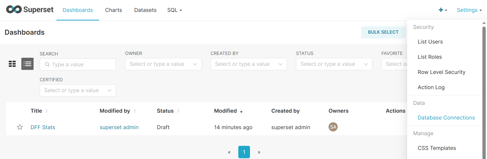

:orphan:

Superset guide
---------------------

Description
~~~~~~~~~~~

| The Dialog Flow Stats module can be used to obtain and visualize usage statistics for your service.
| Data aggregation relies on the `OpenTelemetry protocol <#>`_ and the `OpenTelemetry collector <#>`_ along with `Clickhouse <https://clickhouse.com/>`_ as an OLAP storage.
| Interactive visualization is powered by `Apache Superset <https://superset.apache.org/>`_.
| All the mentioned services are shipped as Docker containers, including a pre-built Superset image that ensures API compatibility.
| Authorization credentials can be automatically configured through environment variables.

.. code-block:: shell

    echo 'SUPERSET_USERNAME=...' >> .env
    echo 'SUPERSET_PASSWORD=...' >> .env
    docker run --env-file='.env' --name=superset ghcr.io/deeppavlov/superset_df_dashboard:latest

Collection procedure
~~~~~~~~~~~~~~~~~~~~

**Installation**

.. code-block:: shell

    pip install dff[stats]

**Launching services**

.. code-block:: shell

    docker-compose up otelcol clickhouse dashboard

**Collecting data**

Collecting data is done by means of instrumenting your conversational service before you run it.
DFF tutorials showcase all the necessary steps, needed to achieve that. We will run
`one of those files <https://deeppavlov.github.io/dialog_flow_framework/tutorials/tutorials.stats.1_extractor_functions.html/>_` 
in order to obtain sample data points to visualize.

.. code-block:: shell

    export DISABLE_INTERACTIVE_MODE=1 && python tutorials/stats/1_extractor_functions.py

Displaying the data
~~~~~~~~~~~~~~~~~~~

In order to display the Superset dashboard, you should update the default configuration with the credentials of your database.
The configuration can be optionally saved as a zip archive for inspection / debug.

You can set most of the configuration options using a YAML file.

.. code-block:: yaml
    :linenos:

    # config.yaml
    db:
        type: clickhousedb+connect
        name: test
        user: username
        host: clickhouse
        port: 8123
        table: otel_logs

The file can then be used to parametrize the configuration script.
Password values can be omitted and set interactively.

.. code-block:: shell
    :linenos:

    dff.stats config.yaml -P -dP \
    -U superset \
    --db.type=clickhousedb+connect \
    --db.user=username \
    --db.host=localhost \
    --db.port=8123 \
    --db.name=test \
    --db.table=otel_logs \
    --outfile=config_artifact.zip

Running the command will automatically import the dashboard as well as the data sources
into the running superset server. If you are using a version of Superset different from the one
shipped with DFF, make sure that your access rights are sufficient to edit the workspace.

Using Superset
~~~~~~~~~~~~~~

| In order to view the imported dashboard, log into `Superset <http://localhost:8088/>_` using your username and password.
| The dashboard will then be available in the **Dashboards** section of the Superset UI under the name of **DFF stats**.
| The dashboard has four sections, each one of them containing different kind of data.

*  The **Overview** section summarizes the information about user interaction with your script. And displays a weighted graph of transitions from one node to another. The data is also shown in the form of a table for better introspection capabilities.

.. figure:: ../_static/images/overview.png

    Overview plots.

* The data displayed in the **General stats** section reports, how frequent each of the nodes in your script was visited by users. The information is aggregated in several forms for better interpretability.

.. figure:: ../_static/images/general_stats.png

    General stats plots.

* The **Additional stats** section includes charts for node visit counts aggregated over various specific variables.

.. figure:: ../_static/images/additional_stats.png

    Additional stats plots.

* General service load data aggregated over time can be found in the **Service stats** section.

.. figure:: ../_static/images/service_stats.png

    Service stats plots.

On some occasions, Superset can show warnings about the database connection being faulty.
In that case, you can navigate to the `Database Connections` section through the `Settings` menu and edit the `dff_database` instance updating the credentials.

    Locate the database settings in the right corner of the screen.