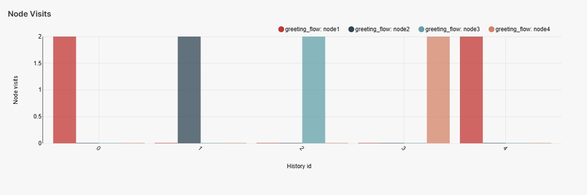

Superset guide
---------------------

Description
~~~~~~~~~~~

| The Dialog Flow Stats module can be used to obtain and visualize usage statistics for your service.
| The module relies on several open source solutions that allow for data persistence and visualization

* `Clickhouse <https://clickhouse.com/>`_ serves as an OLAP storage for data.
* Batching and preprocessing data is based on `OpenTelemetry protocol <https://opentelemetry.io/docs/what-is-opentelemetry/>`_ and the `OpenTelemetry collector <https://opentelemetry.io/docs/collector/>`_.
* Interactive visualization is powered by `Apache Superset <https://superset.apache.org/>`_.

All the mentioned services are shipped as Docker containers, including a pre-built Superset image that ensures API compatibility.

Collection procedure
~~~~~~~~~~~~~~~~~~~~

**Installation**

.. code-block:: shell

    pip install dff[stats]

**Launching services**

.. code-block:: shell
    :linenos:

    # clone the original repository to access the docker-compose file
    git clone https://github.com/deeppavlov/dialog_flow_framework.git
    # launch the required services
    cd dialog_flow_framework
    docker-compose up otelcol clickhouse dashboard

**Collecting data**

Collecting data is done by means of instrumenting your conversational service before you run it.
DFF tutorials showcase all the necessary steps, needed to achieve that. We will run
`one of those files <../tutorials/tutorials.stats.1_extractor_functions.py>`_ 
in order to obtain sample data points to visualize.

.. code-block:: shell

    export DISABLE_INTERACTIVE_MODE=1 && python tutorials/stats/1_extractor_functions.py

Displaying the data
~~~~~~~~~~~~~~~~~~~

In order to display the Superset dashboard, you should update the default configuration with the credentials of your database.
The configuration can be optionally saved as a zip archive for inspection / debug.

You can set most of the configuration options using a YAML file.
The default example file can be found in the `tutorials/stats` directory:

.. code-block:: yaml
    :linenos:

    # tutorials/stats/example_config.yaml
    db:
        driver: clickhousedb+connect
        name: test
        user: username
        host: clickhouse
        port: 8123
        table: otel_logs

The file can then be used to parametrize the configuration script.

.. code-block:: shell

    dff.stats tutorials/stats/example_config.yaml -P superset -dP pass -U superset --outfile=config_artifact.zip

.. warning::
    
    Here we passed passwords via CLI, which is not recommended. For enhanced security, call the command above omitting the passwords (`dff.stats -P -dP -U superset ...`) and you will be prompted to enter them interactively.

Running the command will automatically import the dashboard as well as the data sources
into the running superset server. If you are using a version of Superset different from the one
shipped with DFF, make sure that your access rights are sufficient to edit the workspace.

Using Superset
~~~~~~~~~~~~~~

| In order to view the imported dashboard, log into `Superset <http://localhost:8088/>`_ using your username and password (which are both `superset` by default and can be configured via `.env_file`).
| The dashboard will then be available in the **Dashboards** section of the Superset UI under the name of **DFF stats**.
| The dashboard has four sections, each one of them containing different kind of data.

*  The **Overview** section summarizes the information about user interaction with your script. And displays a weighted graph of transitions from one node to another. The data is also shown in the form of a table for better introspection capabilities.

.. figure:: ../_static/images/overview.png

    Overview plots.

* The data displayed in the **General stats** section reports, how frequent each of the nodes in your script was visited by users. The information is aggregated in several forms for better interpretability.

.. figure:: ../_static/images/general_stats.png

    General stats plots.

* The **Additional stats** section includes charts for node visit counts aggregated over various specific variables.

    Additional stats plots.

* General service load data aggregated over time can be found in the **Service stats** section.

.. figure:: ../_static/images/service_stats.png

    Service stats plots.

On some occasions, Superset can show warnings about the database connection being faulty.
In that case, you can navigate to the `Database Connections` section through the `Settings` menu and edit the `dff_database` instance updating the credentials.

.. figure:: ../_static/images/databases.png

    Locate the database settings in the right corner of the screen.