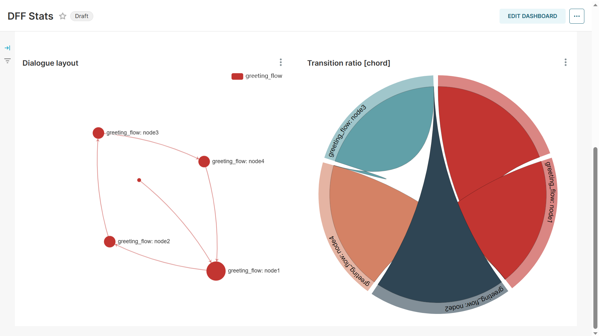
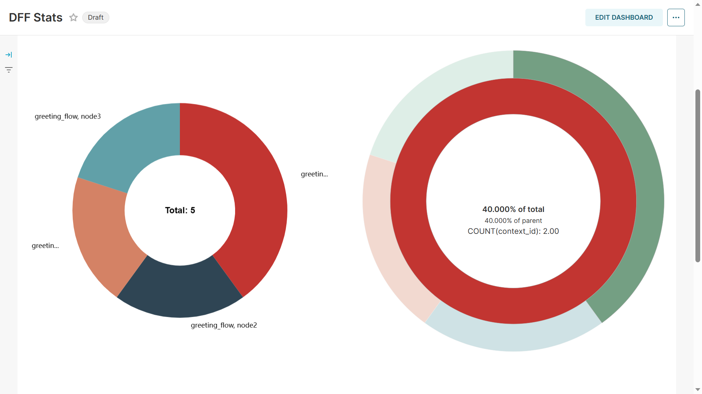

Superset guide
---------------------

Description
~~~~~~~~~~~

| The Dialog Flow Stats module can be used to obtain and visualize usage statistics for your service.
| The module relies on several open source solutions that allow for data persistence and visualization

* `Clickhouse <https://clickhouse.com/>`_ serves as an OLAP storage for data.
* Batching and preprocessing data is based on `OpenTelemetry protocol <https://opentelemetry.io/docs/what-is-opentelemetry/>`_ and the `OpenTelemetry collector <https://opentelemetry.io/docs/collector/>`_.
* Interactive visualization is powered by `Apache Superset <https://superset.apache.org/>`_.

All the mentioned services are shipped as Docker containers, including a pre-built Superset image that ensures API compatibility.

Collection procedure
~~~~~~~~~~~~~~~~~~~~

**Installation**

.. code-block:: shell
    :linenos:

    # clone the original repository to access the docker compose file
    git clone https://github.com/deeppavlov/dialog_flow_framework.git
    # install with the stats extra
    cd dialog_flow_framework
    pip install .[stats]

**Launching services**

.. code-block:: shell
    :linenos:

    # clone the original repository to access the docker compose file
    git clone https://github.com/deeppavlov/dialog_flow_framework.git
    # launch the required services
    cd dialog_flow_framework
    docker compose --profile stats up

**Collecting data**

Collecting data is done by means of instrumenting your conversational service before you run it.
DFF tutorials (`1 <../tutorials/tutorials.stats.1_extractor_functions.py>`_, `2 <../tutorials/tutorials.stats.2_pipeline_integration.py>`_)
showcase all the steps needed to achieve that. We will run 
a special script in order to obtain richly-annotated sample data points to visualize.

.. code-block:: shell

    python utils/stats/sample_data_provider.py

Displaying the data
~~~~~~~~~~~~~~~~~~~

In order to display the Superset dashboard, you should update the default configuration with the credentials of your database.
The configuration can be optionally saved as a zip archive for inspection / debug.

You can set most of the configuration options using a YAML file.
The default example file can be found in the `tutorials/stats` directory:

.. code-block:: yaml
    :linenos:

    # tutorials/stats/example_config.yaml
    db:
        driver: clickhousedb+connect
        name: test
        user: username
        host: clickhouse
        port: 8123
        table: otel_logs

The file can then be used to parametrize the configuration script.

.. code-block:: shell

    dff.stats tutorials/stats/example_config.yaml -P superset -dP pass -U superset --outfile=config_artifact.zip

.. warning::
    
    Here we passed passwords via CLI, which is not recommended. For enhanced security, call the command above omitting the passwords (`dff.stats -P -dP -U superset ...`) and you will be prompted to enter them interactively.

Running the command will automatically import the dashboard as well as the data sources
into the running superset server. If you are using a version of Superset different from the one
shipped with DFF, make sure that your access rights are sufficient to edit the workspace.

Using Superset
~~~~~~~~~~~~~~

| In order to view the imported dashboard, log into `Superset <http://localhost:8088/>`_ using your username and password (which are both `superset` by default and can be configured via `.env_file`).
| The dashboard will then be available in the **Dashboards** section of the Superset UI under the name of **DFF stats**.
| The dashboard is split into four sections based on the types of charts and on the chart topic.

*  The **Overview** section summarizes the information about user interaction with your script. And displays a weighted graph of transitions from one node to another. The data is also shown in the form of a table for better introspection capabilities.

    Overview plots.

* The data displayed in the **Node stats** section reports, how frequent each of the nodes in your script was visited by users. The information is aggregated in several forms for better interpretability.

    Node stats plots.

* General service load data aggregated over time can be found in the **Service stats** section.

.. figure:: ../_static/images/service_stats.png

    Service stats plots.

* The **Annotations** section contains example charts that show how annotations from supplemental pipeline services can be viewed and analyzed.

.. figure:: ../_static/images/annotations.png

    Plots for pipeline-produced dialog annotations.

On some occasions, Superset can show warnings about the database connection being faulty.
In that case, you can navigate to the `Database Connections` section through the `Settings` menu and edit the `dff_database` instance updating the credentials.

.. figure:: ../_static/images/databases.png

    Locate the database settings in the right corner of the screen.

Customizing the dashboard
~~~~~~~~~~~~~~~~~~~~~~~~~

The most notable advantage of using Superset as a visualization tool is that it provides
an easy and intuitive way to create your own charts and to customize the dashboard.

**Datasets**

If you aim to create your own chart, Superset will prompt you to select a dataset to draw data from.
The current configuration provides three datasets `dff-node-stats`, `dff-stats`, and `dff-final-nodes`.
However, in most cases, you would use `dff-stats` or `dff-node-stats`. The former contains all data points,
while the latter only includes the logs produced by `get_current_label` extractor
(`see the API reference <../apiref/dff.stats.default_extractors.html#dff.stats.default_extractors.get_current_label>`_).
`dff-final-nodes` contains the same information as the said datasources,
but only aggregates the labels of nodes visited at the end of dialog graph traversal,
i.e. nodes that terminate the dialog.

`dff-nodes-stats` uses the following variables to store the data:

* The `context_id` field can be used to distinguish dialog contexts from each other and serves as a user identifier.
* `request_id` is the number of the dialog turn at which the data record was emitted. The data points can be aggregated over this field, showing the distribution of a variable over the dialog history.
* The `data_key` field contains the name of the extractor function that emitted the given record. Since in most cases you will only need the output of one extractor, you can filter out all the other records using filters.
* Finally, the `data` field is a set of JSON-encoded key-value pairs. The keys and values differ depending on the extractor function that emitted the data (you can essentially save arbitrary data under arbitrary keys), which makes filtering the data rows by their `data_key` all the more important. The JSON format implies that individual values need to be extracted using the Superset SQL functions (see below).

.. code-block::

    JSON_VALUE(data, '$.key')
    JSON_VALUE(data, '$.outer_key.nested_key')

**Chart creation**

.. note::

    Chart creation is described in detail in the official Superset documentation.
    We suggest that you consult it in addition to this section:
    `link <https://superset.apache.org/docs/creating-charts-dashboards/exploring-data/#pivot-table>`_.

Creating your own chart is as easy as navigating to the `Charts` section of the Superset app
and pressing the `Create` button.

Initially, you will be prompted for the dataset that you want to use as well as for the chart type.
The Superset GUI provides comprehensive previews of each chart type making it very easy
to find the exact kind that you need.

At the next step, you will be redirected to the chart creation interface.
Depending on the kind of chat that you have chosen previously, menus will be available
to choose a column for the x-axis and, optionally, a column for the y-axis. As mentioned above,
a separate menu for data filters will also be available. If you need to use the data
from the `data` column, you will need to find the `custom_sql` option when adding the column
and put in the extraction expression, as shown in the examples above.

**Exporting the chart configuration**

The configuration of a Superset dashboard can be easily exported and then reused
in other Superset instances. This can be done using the GUI: navigate to the
`Dashboards` section of the Superset application, locate your dashboard (named `DFF statistics` per default).
Then press the `export` button on the right and save the zip file to any convenient location.

**Importing existing configuration files**

If you need to restore your dashboard or update the configuration, you can import a configuration archive
that has been saved in the manner described below.

Log in to Superset, open the `Dashboards` tab and press the import button on the right of the screen.
You will be prompted for the database password. If the database credentials match,
the updated dashboard will appear in the dashboard list.